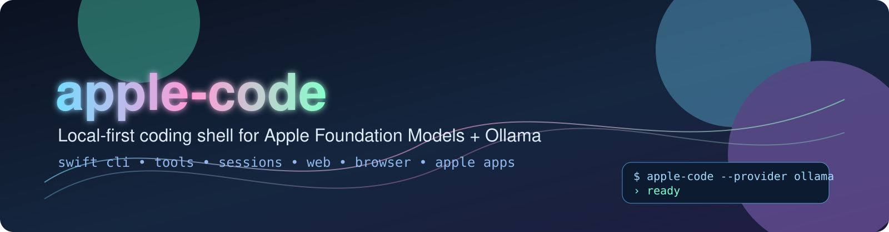
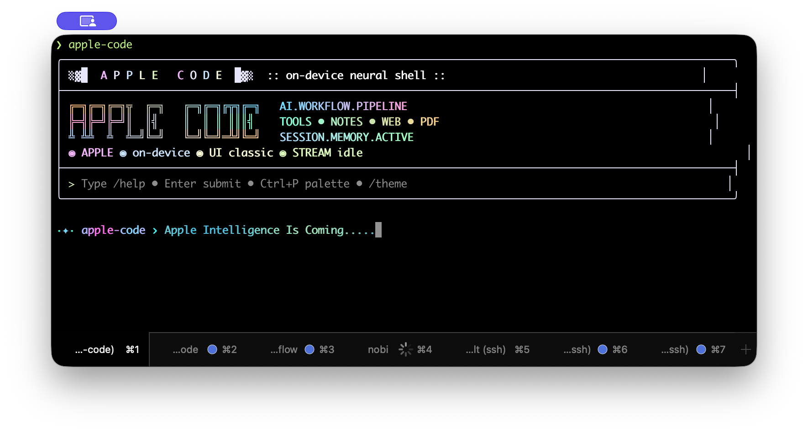
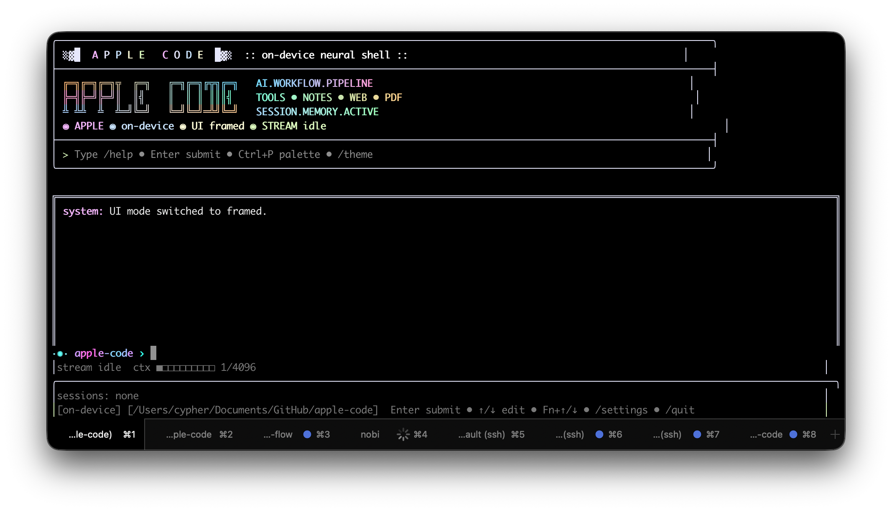

# apple-code

<p align="center">
  
</p>

<p align="center">
  Local-first coding shell for Apple Foundation Models, Private Cloud Compute, Ollama, and Codex CLI.
</p>

<p align="center">
  <a href="https://github.com/dkyazzentwatwa/apple-code/actions/workflows/ci.yml"></a>
  
  
  <a href="LICENSE"></a>
</p>

<p align="center">
  
  
</p>

`apple-code` is a Swift CLI assistant for local coding workflows on macOS. It runs on-device with Apple Foundation Models by default, can switch to local Ollama models, can stage Apple Private Cloud Compute for larger WWDC26-era reasoning turns, and can delegate heavier coding turns to the authenticated Codex CLI.

## Highlights

- Provider choices: `apple`, `apple-pcc`, `ollama`, `codex`, plus experimental `coreai` and `mlx`
- Fast settings menu in REPL: `/settings` or `Ctrl+P`, including provider switching
- Dynamic local Ollama model picker using `ollama list`
- Codex CLI handoff with `/codex` or `--provider codex`
- Tool-calling support for filesystem, shell, web, browser, PDF, and Apple apps
- Session persistence, transcript history, and quick session switching
- Two UI modes (`classic`, `framed`) and multiple built-in themes

## Requirements

- macOS 26+ (Tahoe) on Apple Silicon
- Xcode 26+ command line tools
- Swift 6.2+ toolchain with FoundationModels support
- Ollama installed locally for `--provider ollama`
- Codex CLI installed and logged in for `--provider codex`

## Install

### Recommended

```bash
./scripts/install.sh
```

Then:

```bash
export PATH="$HOME/.local/bin:$PATH"
apple-code
```

Installer options:

```bash
./scripts/install.sh --help
```

### Run from Source

```bash
swift run apple-code
swift run apple-code "summarize this repo"
```

## Quick Start

```bash
# REPL
apple-code

# One-shot
apple-code "summarize this repo"

# Specific project directory
apple-code --cwd ~/projects/myapp
```

## Providers

### Apple Foundation Models (default)

```bash
apple-code --provider apple
```

### Apple Private Cloud Compute (WWDC26 lane)

```bash
apple-code --provider apple-pcc --reasoning moderate
```

`apple-pcc` is wired into config, status, context budgeting, and settings. Runtime execution requires an Apple Foundation Models SDK that exposes `PrivateCloudComputeLanguageModel` and PCC access for your developer account/device. Until then, `/model` reports fallback guidance instead of failing mysteriously.

### Ollama (local)

```bash
export OLLAMA_BASE_URL="http://127.0.0.1:11434"
export OLLAMA_MODEL="qwen3.5:4b"

apple-code --provider ollama --model qwen3.5:4b
```

If a model is missing:

```bash
ollama pull qwen3.5:4b
```

In REPL, `/settings` can prompt and run pulls for you.

### Codex CLI

Codex defaults to `gpt-5.4`. Override it with `--model` or `CODEX_MODEL`:

```bash
export CODEX_MODEL="gpt-5.4"
apple-code --provider codex "review this repo"
apple-code --provider codex --model gpt-5.4 "make a plan for this bug"
```

### Experimental Core AI and MLX

```bash
apple-code --provider coreai --model /path/to/model.aimodel
apple-code --provider mlx --model mlx-community/Qwen3-4B-4bit
```

These are opt-in placeholders for macOS 27+/Xcode 27+ local-model work. Use Ollama for practical larger local models today.

In REPL:

```text
/settings -> Select Provider -> Codex CLI
/codex
/codex inspect the current working tree and suggest the next fix
```

Use `/settings -> Select Provider -> Codex CLI` to make Codex the active TUI provider. `/codex` without a prompt is the shortcut for the same switch, and `/codex <prompt>` runs a one-off Codex turn in the current session. Codex execution uses `codex exec`, the current working directory, `--color never`, and a sandbox derived from apple-code's security profile.

## CLI Options

```text
apple-code [options] ["prompt"]

--system "..."          Custom system instructions
--cwd /path/to/dir      Working directory for file/command tools
--provider <name>       Model provider: apple | apple-pcc | ollama | codex | coreai | mlx
--model <id>            Model ID (ollama/codex/coreai/mlx)
--base-url <url>        Base URL for ollama (default: http://127.0.0.1:11434)
--reasoning <level>     PCC reasoning level: light | moderate | deep
--image /path           Attach image input (repeatable; requires vision-capable Apple model)
--ui <mode>             UI mode: classic | framed
--timeout N             Max seconds (default: 120)
--no-apple-tools        Disable Apple app tools (Notes, Mail, etc.)
--check-apple-tools     Run Apple app diagnostics and exit
--no-web-tools          Disable dedicated web search/fetch tools
--no-browser-tools      Disable browser automation tools
--run-web-fetch <url>   Run webFetch tool directly and exit
--run-web-search "q"    Run webSearch tool directly and exit
--run-web-limit N       Result count for --run-web-search (default: 5)
--run-notes-action a    Run notes tool directly and exit
--run-notes-query q     Query/title for --run-notes-action
--run-notes-body b      Body text for --run-notes-action
--security-profile p    Security profile: secure | balanced | compatibility
--allow-path /path      Additional allowed filesystem root (repeatable)
--allow-host host       Allowed web host/domain (repeatable)
--allow-private-network Allow localhost/private network URLs
--dangerous-without-confirm Allow dangerous mutating actions without extra gate
--allow-fallback-execution  Allow automatic refusal fallback tool execution
--privacy-redaction m  Redaction mode: off | logs | transcripts | all
--verbose               Show full output (disable summary mode)
-i, --interactive       Force interactive mode
--resume <session-id>   Resume a session
--new                   Start a new session
-h, --help              Show help
```

## REPL Commands

Core:

- `/new`, `/n`
- `/sessions`, `/s`
- `/resume <id>`
- `/delete <id>`
- `/history [n]`
- `/show <id>`
- `/quit`, `/q`

Settings and model control:

- `/settings` - provider picker for Apple Foundation Models, PCC, Ollama, Codex CLI, Core AI, and MLX
- `/codex [prompt]`
- `/model`, `/m`
- `/ui [classic|framed]`
- `/theme <wow|minimal|classic|solar|ocean|forest>`
- `/session <id|next|prev>`

Utility:

- `/cd <path>`
- `/clear`, `/c`
- `/help`, `/h`

Compatibility:

- `:commands` are still supported

Hotkeys:

- `Ctrl+P` open settings
- `Esc (Ctrl+[)` previous session chip
- `Ctrl+]` next session chip
- Arrow keys for inline editing/history
- `Ctrl+J` insert newline in input

## Built-in Tools

| Category | Tools |
|---|---|
| Filesystem | `readFile`, `writeFile`, `listDirectory`, `searchFiles`, `searchContent`, `createPDF` |
| Shell | `runCommand` |
| Apple apps | `notes`, `mail`, `calendar`, `reminders`, `messages` |
| Web | `webSearch`, `webFetch` |
| Browser automation | `agentBrowser` |

## Security Defaults

`apple-code` runs in the `secure` profile by default. Filesystem tools are confined to the working directory plus any `--allow-path` roots, private network URLs are blocked, risky shell commands require opt-in, mutating Apple/browser/git actions are blocked unless `--dangerous-without-confirm` is set, and automatic fallback execution is disabled unless `--allow-fallback-execution` is set.

Security and privacy settings can also live in `~/.apple-code/config` or project `.apple-code`:

```text
provider = apple-pcc
reasoning_level = moderate
security_profile = secure
allow_paths = /tmp,/Users/me/project
allow_hosts = developer.apple.com
allow_private_network = false
dangerous_without_confirm = false
allow_fallback_execution = false
privacy_redaction = logs
```

Session, UI, and audit files under `~/.apple-code` are written with user-only file permissions. `privacy_redaction = logs` is the default; use `all` to redact transcripts before they are persisted.

## Troubleshooting

Check installed binary:

```bash
which apple-code
apple-code --help
```

Validate Apple app integrations:

```bash
apple-code --check-apple-tools
```

Validate Ollama:

```bash
ollama list
curl http://127.0.0.1:11434/api/tags
```

If `--provider ollama` fails:

- Confirm Ollama is running locally with `ollama serve`
- Verify model exists with `ollama list`
- Set `OLLAMA_BASE_URL` if using a non-default host/port

Validate Codex CLI:

```bash
which codex
codex --version
codex login status
```

If `--provider codex` fails:

- Confirm Codex is installed and on `PATH`
- Confirm you are logged in with `codex login`
- Try the same prompt directly with `printf '%s\n' "hello" | codex exec --cd "$PWD" --color never -`

## Development

```bash
swift build
swift build -c release
swift test
./scripts/coverage.sh
./scripts/check.sh
```

`./scripts/check.sh` is the local production gate. It runs build, tests, and coverage. `./scripts/coverage.sh` enforces an 80% line-coverage gate on the unit-testable core modules and also prints full-project coverage for visibility.

## License

Released under the MIT License. See [LICENSE](LICENSE).
